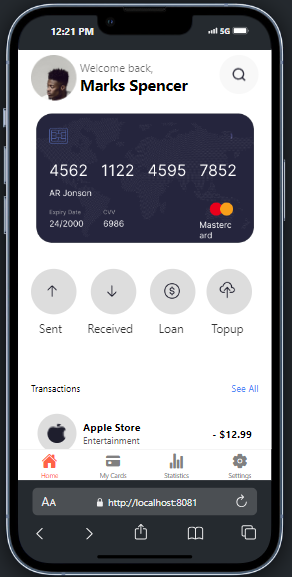
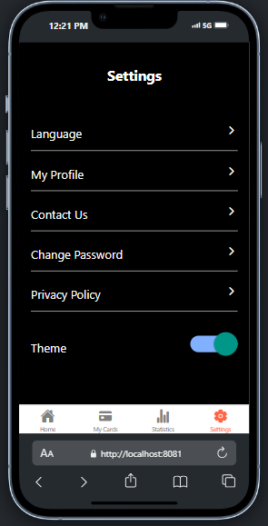

# rn-assignment5-ID-11285821

## Features

- **Theme Switching**: Users can switch between light and dark themes to suit their preferences.
- **Home Screen**: The main screen where users are able to see their cards and bills.
- **Settings Screen**: Allows users to customize their app experience like their prefered language, theme, etc.
- **My Cards Screen**:This allow the user to access all the cards the user has used.
- **Statistics Screen**: This screen provide all the accounts transactions made with each card. 
- **Custom Components**: The app uses custom components throughout to provide a unique user experience.

## Getting Started

To get started with the app, clone the repository and install the required dependencies.
- _npm install_
- _npm start_
**Choose the preferred choice to display your work for example (android, ios and web)**

## Usage

The default theme color for this app is white, and the other theme color is black.

## Screenshots
   # Before

- The Home Page

- The Settings Page

   # After

- The Home Page

!
- The Settings Page